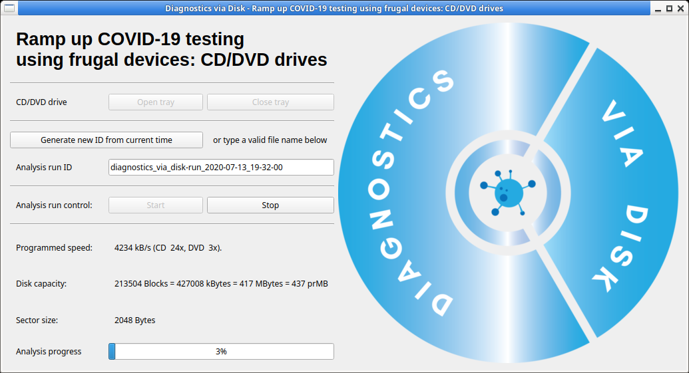

# Diagnostics Via Disk

## Ramp up COVID-19 testing using frugal devices: CD/DVD drives

This is a proof-of-concept for hackster project at https://www.hackster.io/laserx/diagnostics-via-disc-5793c0 for [The COVID-19 Detect &amp; Protect Challenge](https://www.hackster.io/contests/UNDPCOVID19)



## How to use

* A graphical user interface.
* A command-line interface is also available.

All this is proof-of-concept level.  It works for us yet the performance might be bad with some specific hardware (CD readers) and there are conditions that we do not test (like no drive or several drives).

## Graphical user interface

### Requirements

* Linux machine with a CD/DVD/BluRay reader/player. For example, a Raspberry Pi and a USB-to-IDE or USB-to-SATA plus external drive is fine.
* CD/DVD/BluRay disk.
* Some packages installed.  Details are provided for a Debian-based OS (including Ubuntu and Raspberry OS).  Please adjust for other Linux-based distributions.

System-wide packages:

```bash
sudo apt-get update ; sudo apt-get install python3 python3-pip python3-qtpy wodim eject git
```

The GUI is built upon Python, qtpy and [guietta](https://guietta.readthedocs.io/en/latest/).

User-wide packages:

```bash
pip3 install qtpy
git clone https://github.com/fidergo-stephane-gourichon/guietta
cd guietta
pip3 install -e $PWD
```

### Launch software

```bash
python3 bioid-gui.py 
```

### Test access to CD-Rom drive

Click on "Open tray" and "Close tray".  The default CD/DVD drive on the system should do what you expect.

