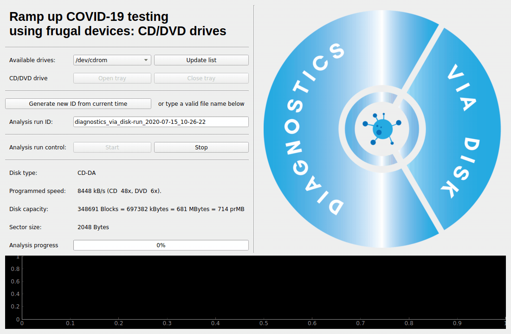

# Diagnostics Via Disk

## Ramp up COVID-19 testing using frugal devices: CD/DVD drives

This is a proof-of-concept for hackster project at https://www.hackster.io/laserx/diagnostics-via-disc-5793c0 for [The COVID-19 Detect &amp; Protect Challenge](https://www.hackster.io/contests/UNDPCOVID19)



## How to use

* A graphical user interface.
* A command-line interface is also available.

All this is proof-of-concept level.  It works for us yet the performance might be bad with some specific hardware (CD readers) and there are conditions that we do not test (like no drive or several drives).

## Requirements

### Hardware

* Linux machine with a CD/DVD/BluRay reader/player. For example, a Raspberry Pi and a USB-to-IDE or USB-to-SATA plus external drive is fine.
* CD/DVD/BluRay disk.

### Software

The code is built upon:

* Python
* Qt (via [qtpy](https://pypi.org/project/QtPy/))
* [pycdio](https://pypi.org/project/pycdio/) | [libcdio2.0.0 for Ubuntu 18.04](https://launchpad.net/~spvkgn/+archive/ubuntu/whipper)
* [guietta](https://guietta.readthedocs.io/en/latest/).
* `readom` (from package `wodim`)

#### Quick install, on Debian and derivatives, using system Python

This is the quickest solution, recommended if you can install everything via packages, for example on Ubuntu 20.04.

Especially on Raspberry Pi where Debian supplies all necessary packages compiled for the Pi's ARM architecture, while Python-side solutions often lack ARM builds.

```bash
bash install-debian-system_python.sh
```

#### Quick install, on Debian and derivatives, using a ad-hoc python virtualenv

This can be useful in older distributions, for example Ubuntu 18.04.

The script installs the base requirements and uses a python virtual environment for other python requirements

```bash
bash install-debian-virtualenv.sh
```

#### Other cases

Details are provided above for a Debian-based OS (including Ubuntu and Raspberry Pi OS).

For other Linux-based distributions, have a look at the scripts, your distributions most certainly provides equivalent commands and perhaps necessary packages.

Once you have `python3` and `pip3` running, most of the rest can be pulled via pythonic ways of doing rather than distribution-centric ways.

For example, if some package `foo` is not available on your distributions via `apt-get install` or equivalent, you may try `pip3 install foo` in the virtualenv.

That said, you will most certainly need builds of `libcdio` and `libiso9660`, for example `libcdio-dev` and `libiso9660-dev`.  If those are not available at all, you may need to recompile them from scratch.

### Launch software

#### Run using bash script
Opens the GUI from the diagvdisk virtual environment created by install-debian-virtualenv.sh
```bash
bash run.sh
```
#### Run Manually
```bash
python3 diagnostics_via_disk.py
```

#### Quick install & run snippet
```bash
git clone https://github.com/zray007/Diagnostics-via-Disk
cd Diagnostics-via-Disk
sudo bash install-debian-system_python.sh
sudo bash run.sh
```

### Test access to CD-Rom drive

Click on "Open tray" and "Close tray".  The default CD/DVD drive on the system should do what you expect.
